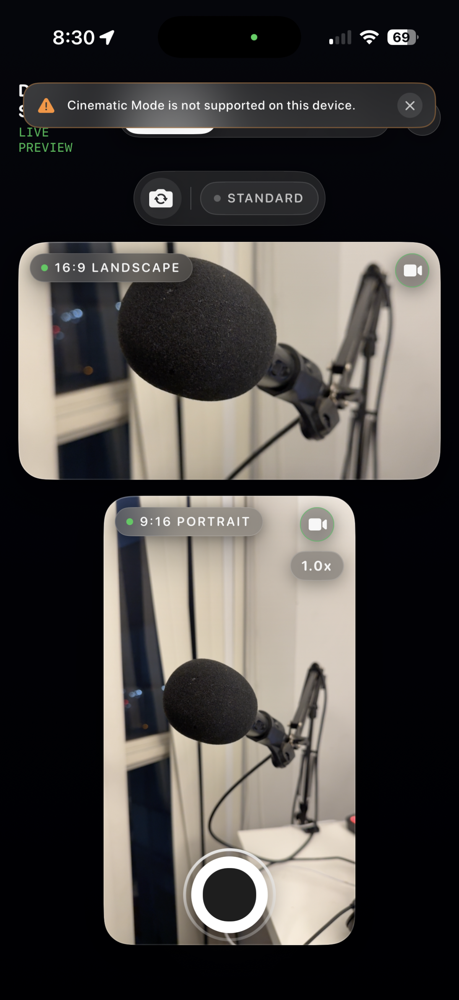
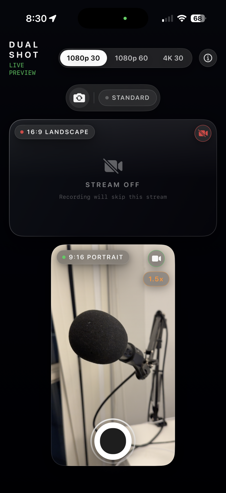
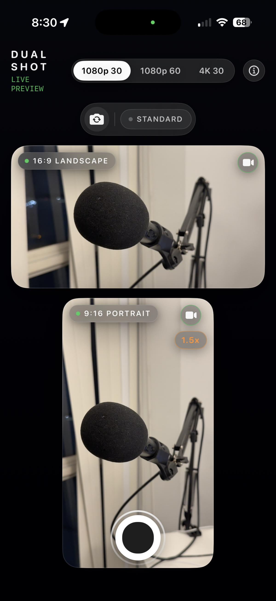
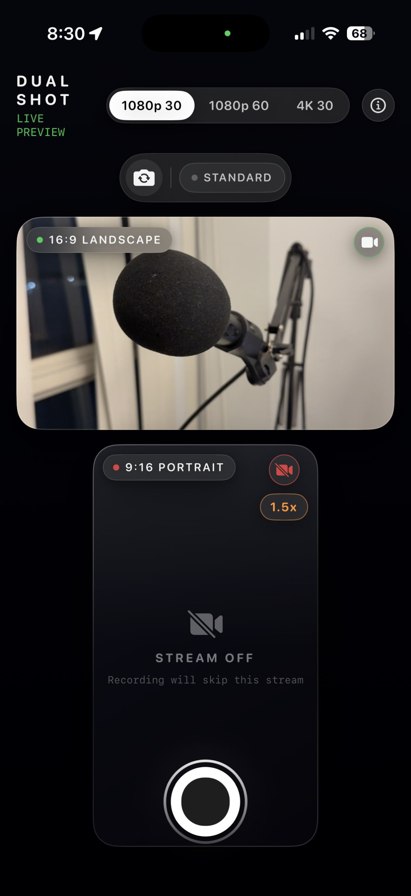

# Dual Aspect Recorder

> **Previously known as DualShot-Camera**

Dual Aspect Recorder is a native SwiftUI + AVFoundation iPhone app that captures one high-quality 4K HEVC master recording and automatically produces both **16:9 landscape** and **9:16 portrait** videos — perfect for cross-platform social media publishing.

<p align="center">
  
  
  
  
</p>

## Features

- **Single master, dual output** — records one 4K HEVC video, exports landscape (16:9) and portrait (9:16) simultaneously
- **Live framing guides** — white (landscape) and yellow dashed (portrait) overlays show crop boundaries without burning them into video
- **Front/rear camera switch** — swap cameras before recording
- **4K 60fps** — auto-selects highest-frame-rate 4K format on supported devices (Triple → DualWide → WideAngle fallback)
- **HEVC hardware encoding** — efficient storage and quality
- **Thermal monitoring** — warns on serious thermal pressure
- **Orientation-aware** — correct rotation and mirroring for front camera

## Requirements

- Xcode 26.2 or newer
- iOS 18 or newer
- iPhone 16 Pro or newer recommended
- A physical iPhone is required (Simulator does not expose camera hardware)

## Setup

1. Open `DualAspectRecorder.xcodeproj` in Xcode
2. Select the `DualAspectRecorder` target
3. Set your Apple Development Team in Signing & Capabilities
4. Build and run on a physical iPhone
5. Grant Camera, Microphone, and Photos add-only permissions when prompted

## Usage

- The **rear camera** is selected by default
- Tap the camera switch button before recording to use the **front camera**
- The **white guide** shows the 16:9 landscape framing area
- The **yellow dashed guide** shows the 9:16 portrait crop area
- Tap **record** to capture a single master
- Tap **stop** to finalize, export both versions, and save both files to Photos

> Framing overlays are preview-only and are **not burned into** the exported videos.

## Architecture

```
DualAspectRecorderApp.swift       ── @main entry point
├── AppModels.swift               ── Enums: CapturePosition, RecorderState, ExportAspect, AppError
├── ContentView.swift             ── SwiftUI UI: camera preview, framing guides, record button
├── CameraPreviewView.swift       ── UIViewRepresentable for AVCaptureVideoPreviewLayer
├── FramingGuidesView.swift       ── White (16:9) + yellow dashed (9:16) overlay guides
├── CameraViewModel.swift         ── @MainActor ObservableObject: state machine, lifecycle
└── Services/
    ├── CameraManager.swift       ── AVCaptureSession, front/rear switch, 4K60 config, orientation
    ├── RecordingWriter.swift     ── Real-time HEVC AVAssetWriter (video + AAC audio)
    ├── ExportService.swift       ── Offline AVMutableComposition + centered crop for both aspects
    ├── PhotoLibraryService.swift ── Add-only PHPhotoLibrary save
    ├── PermissionManager.swift   ── Camera/mic/Photos authorization
    └── ThermalMonitor.swift      ── Observes thermal pressure, warns in UI
```

## Performance

- **Single capture pipeline** — records one master, exports offline (avoids dual-encode thermal issues)
- **HEVC hardware encoding** — efficient on Apple Silicon
- **Adaptive bitrate** — 90 Mbps (4K), 35 Mbps (1080p), 16 Mbps (lower)
- **Frame dropping** — drops late preview frames during recording to protect A/V sync
- **Background processing** — recording and export on dedicated serial queues, not the main actor
- **Minimal permissions** — Photos `.addOnly` authorization level only

## License

MIT
